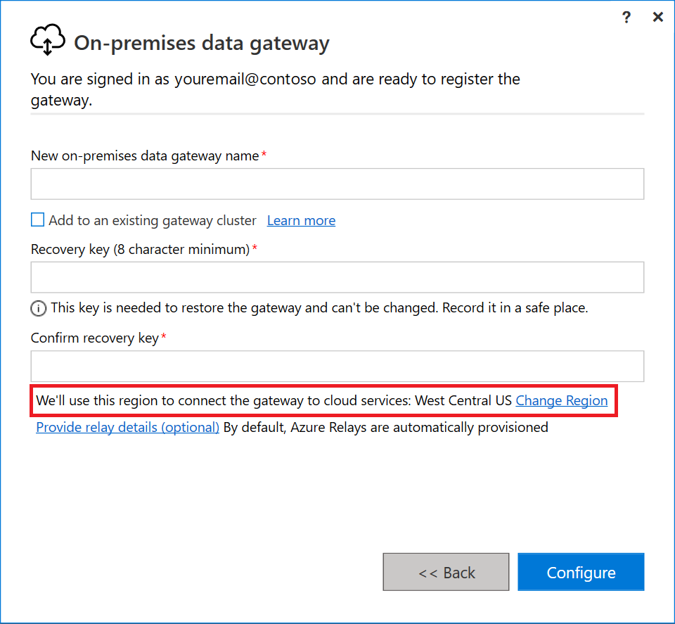
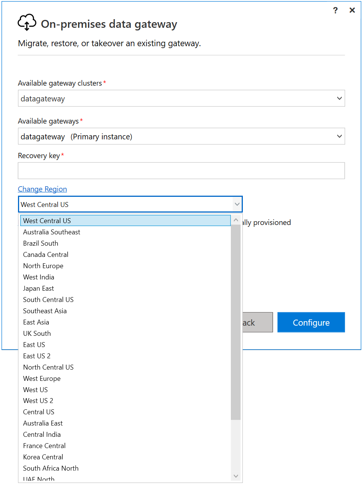
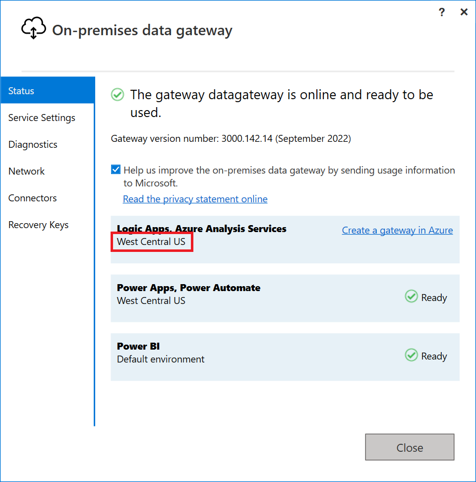

# Set the datacenter region for the on-premises data gateway

[!INCLUDE [gateway-rewrite](../includes/gateway-rewrite.md)]

During installation of the on-premises data gateway, you can set the datacenter region used by the gateway.

If you have registered for either Power BI or Office 365, the datacenter region is the region of the registered service's tenant. Otherwise, the datacenter region might be the Azure region closest to you.

## Change the datacenter region

If you want to change the datacenter region after your gateway is installed, you can:

- Restore the gateway on the current gateway machine.
- Migrate the gateway to a different machine.
- Take over the gateway on a different machine.

## Current datacenter region

To find the current datacenter region after the gateway is installed:

1. Open the [on-premises data gateway app](service-gateway-app.md) and sign in to your account.
1. In the **Status** tab, your datacenter region is shown under **Logic Apps, Azure Analysis Services**.

   

For more information about setting the datacenter region for your resources, [watch this video](https://guyinacube.com/2018/01/power-bi-azure-analysis-services-gateway-data-region/).

## Next steps

* [Adjust communications settings](service-gateway-communication.md)
