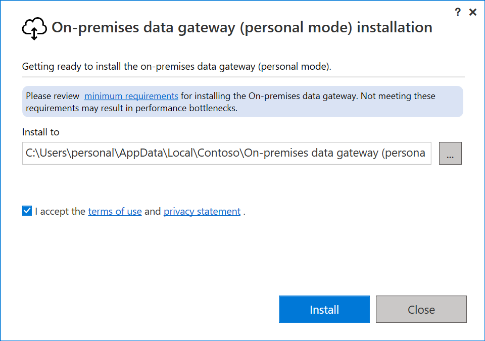

---

title: "Install an on-premises data gateway"
description: Learn how to install a gateway so you can connect to on-premises data.
author: arthiriyer
manager: kvivek
ms.reviewer: kvivek
ms.prod: on-premises-data-gateway
ms.technology:
ms.topic: conceptual
ms.date: 02/11/2021
ms.author: arthii

LocalizationGroup: Gateways
---

# Install an on-premises data gateway

An on-premises data gateway is software that you install in an on-premises network. The gateway facilitates access to data in that network.

As we explain in the [overview](service-gateway-onprem.md#types-of-gateways), you can install a gateway either in personal mode, which applies to Power BI only, or in standard mode. We recommend standard mode. In that mode, you can install a standalone gateway or add a gateway to a cluster, which we recommend for high availability.

In this article, we show you how to install a standard gateway, how to add another gateway to create a cluster, and how to install a personal mode gateway.

## Requirements

### Minimum requirements

* .NET Framework 4.7.2 (Gateway release December 2020 and earlier)
* .NET Framework 4.8 (Gateway release February 2021 and later)
* A 64-bit version of Windows 8 or a 64-bit version of Windows Server 2012 R2 with [current TLS 1.2 and cipher suites](/power-platform/admin/onpremises-server-cipher-tls-requirements)
* 4 GB disk space for [performance monitoring](service-gateway-performance.md#gateway-performance-monitoring-public-preview) logs (in default configuration)

> [!NOTE]
> The minimum screen resolution supported for the on-premises data gateway is 1280 x 800.

### Recommended

* An 8-core CPU
* 8 GB of memory
* A 64-bit version of Windows Server 2012 R2 or later
* Solid-state drive (SSD) storage for spooling.

### Related considerations

* Gateways aren't supported on Server Core installations.
* The user installing the gateway must be the admin of the gateway.
* The gateway can't be installed on a domain controller.
* If you're planning to use Windows authentication, make sure you install the gateway on a computer that's a member of the same Active Directory environment as the data sources.
* Don't install a gateway on a computer, like a laptop, that might be turned off, asleep, or disconnected from the internet. The gateway can't run under any of those circumstances.
* If a gateway uses a wireless network, its performance might suffer.
* You could install other applications on the gateway machine, but this may degrade gateway performance. If you do install other applications on the gateway machine, be sure to monitor the gateway closely to check if there's any resource contention. 
* You can install up to two gateways on a single computer: one running in personal mode and the other running in standard mode. You can't have more than one gateway running in the same mode on the same computer.

## Download and install a standard gateway

Because the gateway runs on the computer that you install it on, be sure to install it on a computer that's always turned on. For better performance and reliability, we recommend that the computer is on a wired network rather than a wireless one.

1. [Download the standard gateway](https://go.microsoft.com/fwlink/?LinkId=2116849&clcid=0x409).

1. In the gateway installer, keep the default installation path, accept the terms of use, and then select **Install**.

    

1. Enter the email address for your Office 365 organization account, and then select **Sign in**.

    

    > [!NOTE]
    > You need to sign in with either a work account or a school account. This account is an *organization account*. If you signed up for an Office 365 offering and didn't supply your work email address, your address might look like nancy\@contoso.onmicrosoft.com. Your account is stored within a tenant in Azure AD. In most cases, your Azure AD account’s User Principal Name (UPN) will match the email address.  

    The gateway is associated with your Office 365 organization account. You manage gateways from within the associated service.

    You're now signed in to your account.

1. Select **Register a new gateway on this computer** > **Next**.

    

1. Enter a name for the gateway. The name must be unique across the tenant. Also enter a recovery key. You'll need this key if you ever want to recover or move your gateway. Select **Configure**.

    

    Note the **Add to an existing gateway cluster** checkbox. We'll use this checkbox in the next section of this article.

    Also note that you can change the region that connects the gateway to cloud services. For more information, see [Set the data center region](service-gateway-data-region.md).

    > [!NOTE]
    > For soverign clouds, we currently only support installing gateways in the default PowerBI region of your tenant. The region picker on the installer is only supported for Public cloud.

    Finally, you can also provide your own Azure Relay details. For more information about how to change the Azure Relay details, see [Set the Azure Relay for on-premises data gateway](service-gateway-azure-relay.md).

1. Review the information in the final window. Because this example uses the same account for Power BI, Power Apps, and Power Automate, the gateway is available for all three services. Select **Close**.

    

Now that you've installed a gateway, you can add another gateway to create a cluster.

## Add another gateway to create a cluster

A cluster lets gateway admins avoid having a single point of failure for on-premises data access. If the primary gateway is unavailable, data requests are routed to the second gateway that you add, and so on.

Because you can install only one standard gateway on a computer, you must install each additional gateway in the cluster on a different computer. This requirement makes sense because you want redundancy in the cluster.

   > [!NOTE]
   > Offline gateway members within a cluster will negatively impact performance. These members should either be removed or disabled.
   >
   > Make sure the gateway members in a cluster are running the same gateway version, as different versions could cause unexpected failures based on supported functionality.

To create high-availability gateway clusters, you need the November 2017 update or a later update to the gateway software.

1. Download the gateway to a different computer and install it.

1. After you sign in to your Office 365 organization account, register the gateway. Select **Add to an existing cluster**. In the **Available gateway clusters** list, select the *primary gateway*, which is the first gateway you installed. Enter the recovery key for that gateway. Select **Configure**.

    

## Download and install a personal mode gateway

1. [Download the personal mode gateway](https://go.microsoft.com/fwlink/?LinkId=2116848&clcid=0x409).

1. In the gateway installer, enter the default installation path, accept the terms of use, and then select **Install**.

    

1. Enter the email address for your Office 365 organization account, and then select **Sign in**.

    

    > [!NOTE]
    > You need to sign in with either a work account or a school account. This account is an *organization account*. If you signed up for an Office 365 offering and didn't supply your work email address, your address might look like nancy\@contoso.onmicrosoft.com. Your account is stored within a tenant in Azure AD. In most cases, your Azure AD account’s User Principal Name (UPN) will match the email address.  

    The gateway is associated with your Office 365 organization account. You manage gateways from within the associated service.

1.  You're now signed in to your account. Select **Close**.

    

## Next steps

* [Configure on-premises data gateways](service-gateway-app.md)

* [Manage an on-premises data gateway](service-gateway-manage.md)

* [Monitor and optimize gateway performance](service-gateway-performance.md)

[!INCLUDE[footer-include](../includes/footer-banner.md)]
