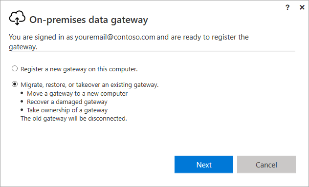

# Migrate, restore, or take over an on-premises data gateway

Run the gateway installer on a computer where you want to migrate, restore, or take over an on-premises data gateway.

If you're restoring the gateway on the computer that has the original gateway installation, you must first uninstall the gateway on that computer.

> [!NOTE]
> If you [remove or delete a gateway cluster](service-gateway-manage.md) in any of the cloud services, you won't be able to restore it.

1. Download the gateway and install it. For more information, see [Install an on-premises data gateway](service-gateway-install.md).

1. After you've signed in to your Office 365 account, register the gateway. Select **Migrate, restore, or takeover an existing gateway** > **Next**.

    

1. Select from the available clusters and gateways, and enter the recovery key for the selected gateway. You created and safely stored the recovery key when you originally installed the gateway. For more information, see step 5 in [Install an on-premises data gateway](service-gateway-install.md).

    >[!Important]
    > Microsoft doesn't have access to this key and it can't be retrieved by us.

1. Select **Configure**.

    

After the configuration finishes, the process of migrating, restoring, or taking over is complete.

## Minimize migration downtime

During migration of an on-premises data gateway, some downtime generally occurs. During this downtime, some in-progress refreshes might not succeed.

If a gateway only contains one member, you should expect the following to occur when you migrate the gateway:

* Expect all ongoing refreshes using the previous machine to be unsuccessful.

* Expect new refreshes starting a few minutes after migration to succeed.

The only way to ensure that there is 100% uptime during a migration:

1. Create a gateway with more than one gateway member ([a cluster of gateways](service-gateway-high-availability-clusters.md)).
2. Disable the gateway that's going to be migrated ([in the Power Platform admin center](/power-platform/admin/onpremises-data-gateway-management#details)).
3. Migrate the disabled gateway member.
4. Re-enable the gateway member.

## Next steps

* [Troubleshoot the on-premises data gateway](service-gateway-tshoot.md)

[!INCLUDE[footer-include](../includes/footer-banner.md)]
