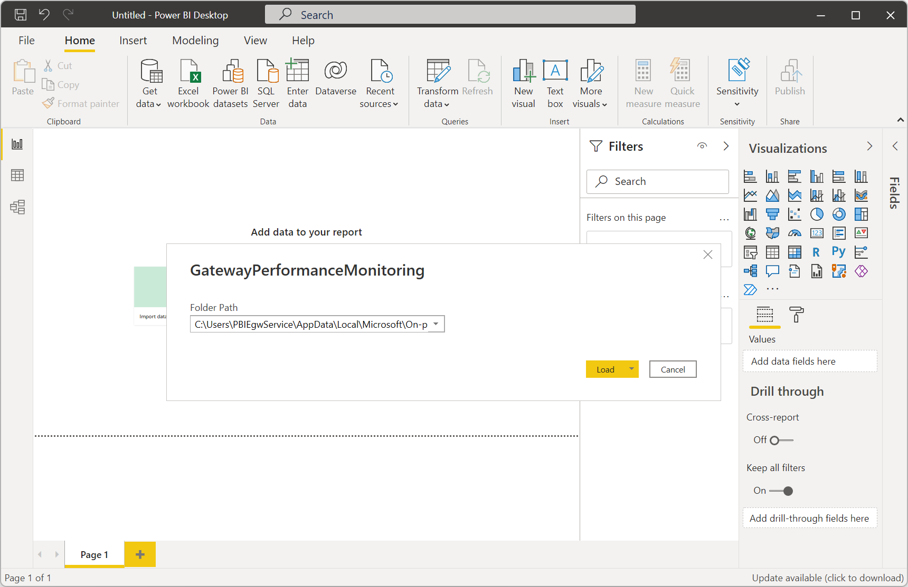
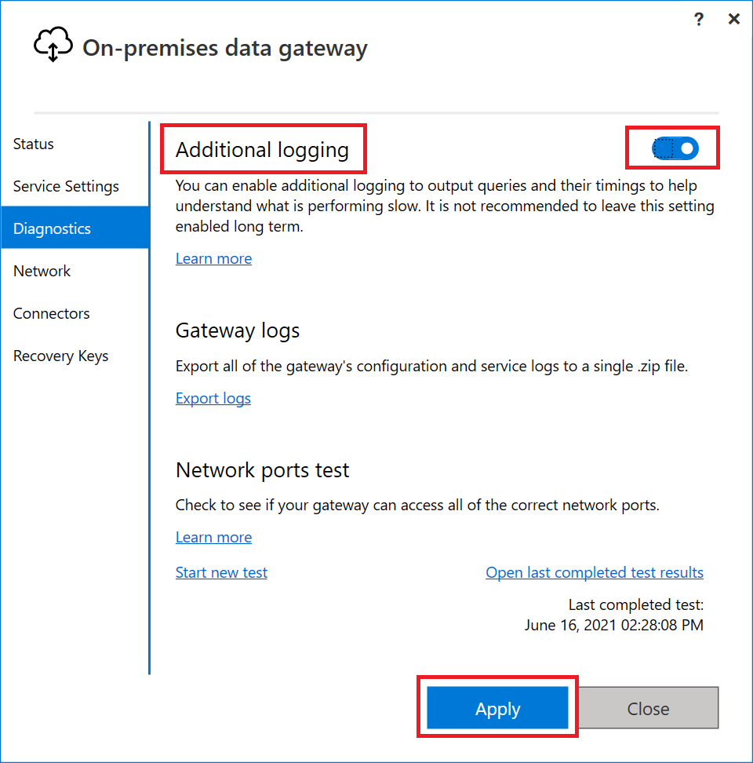

# Monitor and optimize on-premises data gateway performance

## Gateway performance monitoring (public preview)

To monitor performance, gateway admins have traditionally depended on manually monitoring performance counters through the Windows Performance Monitor tool. We now offer additional query logging and a [Gateway Performance PBI template file](https://download.microsoft.com/download/D/A/1/DA1FDDB8-6DA8-4F50-B4D0-18019591E182/OnPremisesDataGatewayLogs.pbit) to visualize the results. This feature provides new insights into gateway usage. You can use it to troubleshoot slow-performing queries.

> [!NOTE]
> This feature is currently available only for the on-premises data gateway in the standard mode. It's not available for the personal mode.

> [!NOTE]
> Gateway diagnostics doesn't capture diagnostics directly related to the (virtual) machine and its network, like bandwidth or latency. However, these diagnostics might impact your gateway performance. You can use resource monitoring tools to monitor your machine.

### Performance logging

This feature is now turned on by default.

>[!NOTE]
>
> * Currently, queries from premium capacity to the gateway are sometimes missed in this logging. We are actively working on fixing this issue.
> * Currently, Power BI paginated report queries aren't logged using this tool.

### Configure Performance logging

There are other values in the config file `C:\Program Files\On-premises data gateway\Microsoft.PowerBI.DataMovement.Pipeline.GatewayCore.dll.config` that you can update as needed:

* **ReportFilePath**: Determines the path where the four log files are stored. By default, this path is either *\Users\PBIEgwService\AppData\Local\Microsoft\On-premises data gateway\Report* or *\Windows\ServiceProfiles\PBIEgwService\AppData\Local\Microsoft\On-premises data gateway\Report*. The path depends on the OS version. If you use a service account for the gateway other than *PBIEgwService*, replace this part of the path with the service account name.
* **ReportFileCount**: Determines the number of log files of each kind to retain. The default value is 10.
* **ReportFileSizeInBytes**: Determines the size of the file to maintain. The default value is 104,857,600.
* **QueryExecutionAggregationTimeInMinutes**: Determines the number of minutes for which the query execution information is aggregated. The default value is 5.
* **SystemCounterAggregationTimeInMinutes**: Determines the number of minutes for which the system counter is aggregated. The default value is 5.

After you make the changes to the config file, restart the gateway for these config values to take effect. The report files are now being generated in the location that you specified for **ReportFilePath**.

> [!NOTE]
> It can take up to 10 minutes plus the amount of time set for **QueryExecutionAggregationTimeInMinutes** in the config file until files start to show up in the folder.

### Understand performance logs

When you turn on this feature, four new log files are created:

* The Query Execution Report
* The Query Start Report
* The Query Execution Aggregation Report
* The System Counter Aggregation Report

The Query Execution Report contains detailed query execution information. The following attributes are captured.

|Attribute |Description |
| ---- | ---- |
|**GatewayObjectId** |Unique identifier for the gateway. |
|**RequestId** |Unique identifier for a gateway request. It could be the same for multiple queries. |
|**DataSource** |Contains both the data source type and data source. |
|**QueryTrackingId** |Unique identifier for a query. It may however repeat if a query fails and is retried. | 
|**QueryExecutionEndTimeUTC** |Time when the query execution completed. |
|**QueryExecutionDuration** (ms) |Duration for a query execution. |
|**QueryType** |Type of query. For instance, the query passed could be a Power BI refresh or DirectQuery. Or, it could be queries from Power Apps and Power Automate. |
|**DataProcessingEndTimeUTC** |Time when data processing activities like spooling, data retrieval, compression, and data processing completed. |
|**DataProcessingDuration** (ms) |Duration for data processing activities like spooling, data retrieval, compression, and data processing. |
|**Success** |Indicates if the query succeeded or failed. |
|**ErrorMessage** |If the query failed, indicates the error message. |
|**SpoolingDiskWritingDuration** (ms) |Indicates the amount of time by the gateway to write all data to disk |
|**SpoolingDiskReadingDuration** (ms) |Indicates the amount of time by the gateway to read all data to disk |
|**SpoolingTotalDataSize** (bytes) |Size(Compressed) of the data that is written to/read from disk |
|**DataReadingAndSerializationDuration** (ms) |Indicates the amount of time the gateway takes to read data from the datasource and serialize them into packets.|
|**DiskRead** (byte/sec) |Indicates bytes read by the gateway per second. DiskRead(byte/sec) =  SpoolingTotalDataSize / SpoolingDiskReadingDuration|
|**DiskWrite** (byte/sec) |Indicates bytes written by the gateway per second. DiskWrite(byte/sec) =  SpoolingTotalDataSize / SpoolingDiskWritingDuration|

The Query Start Report contains the query and the query start time. The following attributes are captured.

|Attribute |Description |
| ---- | ---- |
|**GatewayObjectId** |Unique identifier for the gateway. |
|**RequestId** |Unique identifier for a gateway request. It could be the same for multiple queries. |
|**DataSource** |Contains both the data source type and data source. |
|**QueryTrackingId** |Unique identifier for a query. It may however repeat if a query fails and is retried. | 
|**QueryExecutionStartTimeUTC** |Time when the query execution started. |
|**QueryType** |Type of query. For instance, the query passed could be a Power BI refresh or DirectQuery. Or, it could be queries from Power Apps and Power Automate. |
|**QueryText** |Complete query encoded with base64. |
|**EvaluationContext**|Contains the artifactId and DatasetId along with additional data depending on the artifact.|

The Query Execution Aggregation Report contains query information aggregated to a time interval by **GatewayObjectId**, **DataSource**, **Success**, and **QueryType**. The default value is 5 minutes, but you can adjust it. The following attributes are captured.

|Attribute |Description |
| ---- | ---- |
|**GatewayObjectId** |Unique identifier for the gateway. |
|**AggregationStartTimeUTC** |Start of the time window for which query attributes were aggregated. |
|**AggregationEndTimeUTC** |End of the time window for which query attributes were aggregated. |
|**DataSource** |Contains both the data source type and data source. |
|**Success** |Indicates if the query succeeded or failed. |
|**AverageQueryExecutionDuration** (ms) |Average query execution time for the aggregation time window. |
|**MaxQueryExecutionDuration** (ms) |Maximum query execution time for the aggregation time window. |
|**MinQueryExecutionDuration** (ms) |Minimum query execution time for the aggregation time window. |
|**QueryType** |Type of query. For instance, the query passed could be a Power BI refresh or DirectQuery. Or, it could be queries from Power Apps and Power Automate. |
|**AverageDataProcessingDuration** (ms) |Average time for data processing activities like spooling, data retrieval, compression, and data processing for the aggregation time window. |
|**MaxDataProcessingDuration** (ms) |Maximum time for data processing activities like spooling, data retrieval, compression, and data processing for the aggregation time window. |
|**MinDataProcessingDuration** (ms) |Minimum time for data processing activities like spooling, data retrieval, compression, and data processing for the aggregation time window. |
|**Count** |Number of queries. |

The System Counter Aggregation Report contains system counter values aggregated to a time interval. The default value is 5 minutes, but you can adjust it. The following attributes are captured.

|Attribute |Description |
| ---- | ---- |
|**GatewayObjectId** |Unique identifier for the gateway. |
|**AggregationStartTimeUTC** |Start of the time window for the system counters that were aggregated. |
|**AggregationEndTimeUTC** |End of the time window for the system counters that were aggregated. |
|**CounterName** |System counters each apply to one server that is hosting a gateway node and include:<br/>&#8226;  **SystemCPUPercent**: CPU used on the server as a percentage of total available CPU.<br/>&#8226; **SystemMEMUsedPercent**: Memory used on the server as a percentage of total available memory.<br/>&#8226; **GatewayCPUPercent**: The sum of the percent of CPU used by the gateway process on each core. To get the percent of the CPU used on the server, divide **GatewayCPUPercent** by the number of cores.<br/>&#8226; **GatewayMEMKb**: Sum of the total memory in kilobytes used by the gateway process. |
|**Max** |Maximum value for the system counter for the aggregation time window. |
|**Min** |Minimum value for the system counter for the aggregation time window. |
|**Average** |Average value for the system counter for the aggregation time window. |

### Visualize gateway performance

Now, you can visualize the data that's in the log files.

1. Download the [Gateway Performance PBI template](https://download.microsoft.com/download/D/A/1/DA1FDDB8-6DA8-4F50-B4D0-18019591E182/OnPremisesDataGatewayLogs.pbit), and open it by using Power BI Desktop.

1. In the dialog box that opens, check that the folder path matches the value in **ReportFilePath**.

    

1. Select **Load**, and the template file starts loading the data from your log files. All visuals are populated by using the data in the reports.

1. Optionally, save this file as a PBIX, and publish it to your service for automatic refreshes. To learn more, go to [Publish datasets and reports from Power BI Desktop](/power-bi/create-reports/desktop-upload-desktop-files).

You also can customize this template file to suit your needs. For more information on Power BI templates, go to this [Microsoft Power BI blog post](https://powerbi.microsoft.com/blog/deep-dive-into-query-parameters-and-power-bi-templates/).

## Monitoring spool storage

By default, spool storage for the gateway is located at C:\Users\PBIEgwService\AppData\Local\Microsoft\On-premises data gateway\Spooler. Be sure to monitor this location to ensure there is adequate free disk space. More information: [Gateway spooling data](service-gateway-configure-disk-space.md#gateway-spooling-data)

## Slow-performing queries

Long-running queries might require additional modification on your data source or further optimization of the query itself. This could be either for Power BI refreshes or for direct database queries, like Power BI DirectQuery, Power Apps, or Azure Logic Apps.

By default, the gateway performs basic logging. If you're investigating slow-performing queries, in addition to using the performance monitoring feature, you can temporarily enable **Additional logging** to gather additional log information. To do this, in the [on-premises data gateway app](service-gateway-app.md) select **Diagnostics** > **Additional logging**.



Enabling this setting likely will increase the log size significantly, based on gateway usage. We recommend that after you finish reviewing the logs that you disable additional logging. We don't recommend leaving this setting enabled during normal gateway usage.

When you turn on this setting, additional information (application context in the following sample) is included in the gateway logs that indicates which dataset or report this query belongs to. Not all services are able to send this information at this time and we are working on known gaps.

```
QueryAdditionalInformation is: {
  "Application": "Dataset-Premium",
  "ObjectId": "6de5b524-8a04-4578-961d-e65b2bf3dcd4",
  "ApplicationContext": "{\"DatasetId\":\"6de5b524-8a04-4578-961d-ej67gdf3dcd4\",\"Sources\":[{\"ReportId\":\"e0cec7bc-f53d-4174-b551-678656fba\"}]}"
}.
```

## Optimize performance by streaming data

By default, the on-premises data gateway spools data before returning it to the dataset, potentially causing slower performance during data load and refresh operations. The default behavior can be overridden.

1. In the C:\Program Files\On-Premises data gateway\Microsoft.PowerBI.DataMovement.Pipeline.GatewayCore.dll.config file, set the **StreamBeforeRequestCompletes** setting to **True**, and then save.

   ```JSON
   <setting name="StreamBeforeRequestCompletes" serializeAs="String">
      <value>True</value>
   </setting>
   ```

2. In **On-premises data gateway** > **Service Settings**, restart the gateway.

## Optimize performance by excluding specific folders from antivirus scanning

In order to avoid potential performance impacts, certain folders can be excluded from antivirus scanning when you use a file-level antivirus software in the server where an on-premises data gateway is installed.
If these folders aren't excluded, you might observe performance impacts and potentially other unexpected behaviors since these folders receive a large amount of write operations and are, at the core, data pipelines of the on-premises data gateway.

### Folders that might have to be excluded from antivirus scanning in the on-premises data gateway server

> [!NOTE]
> The following place holder Drive represents the letter of the drive on which the on-premises data gateway is installed. Typically, the driver letter is C.
> The following place holder ServiceAccount represents the service account that's running the on-premises data gateway. The default account is PBIEgwService.

* Logging directory: **Drive**:\Windows\ServiceProfiles\ **ServiceAccount** \AppData\Local\Microsoft\On-premises data gateway
* Spool storage directory: **Drive**:\Windows\ServiceProfiles\ **ServiceAccount** \AppData\Local\Microsoft\On-premises data gateway\Spooler

## Next steps

* [Troubleshooting tools](service-gateway-tshoot.md#troubleshooting-tools)
