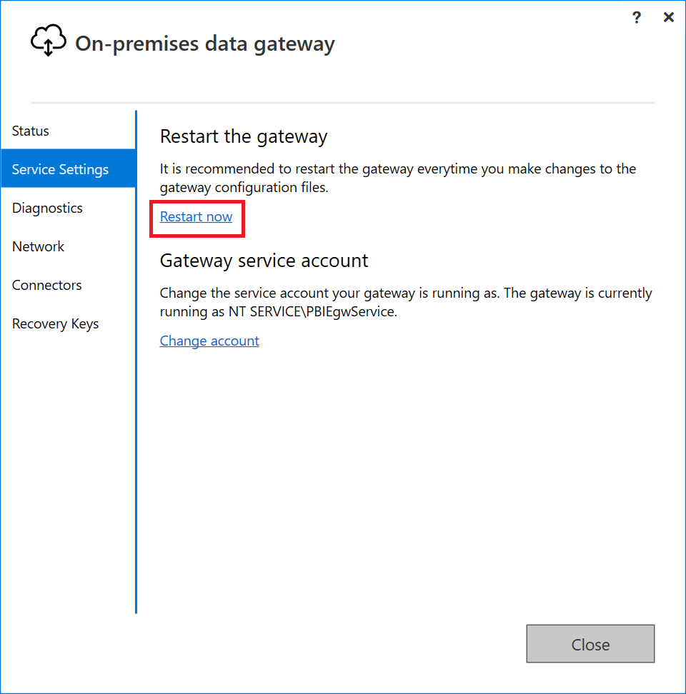
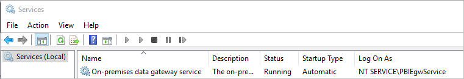

# Restart an on-premises data gateway

Restart the on-premises data gateway service with any of the following methods.

* In the [gateway app](service-gateway-app.md), select **Service Settings**, then select **Restart now**.

    

* In the services app, select the gateway service and then restart.

    

* In an admin Command Prompt window, use the following commands.

    `net stop PBIEgwService`

    `net start PBIEgwService`

## Next steps

* [Tenant level administration](/power-platform/admin/onpremises-data-gateway-management)

[!INCLUDE[footer-include](../includes/footer-banner.md)]
