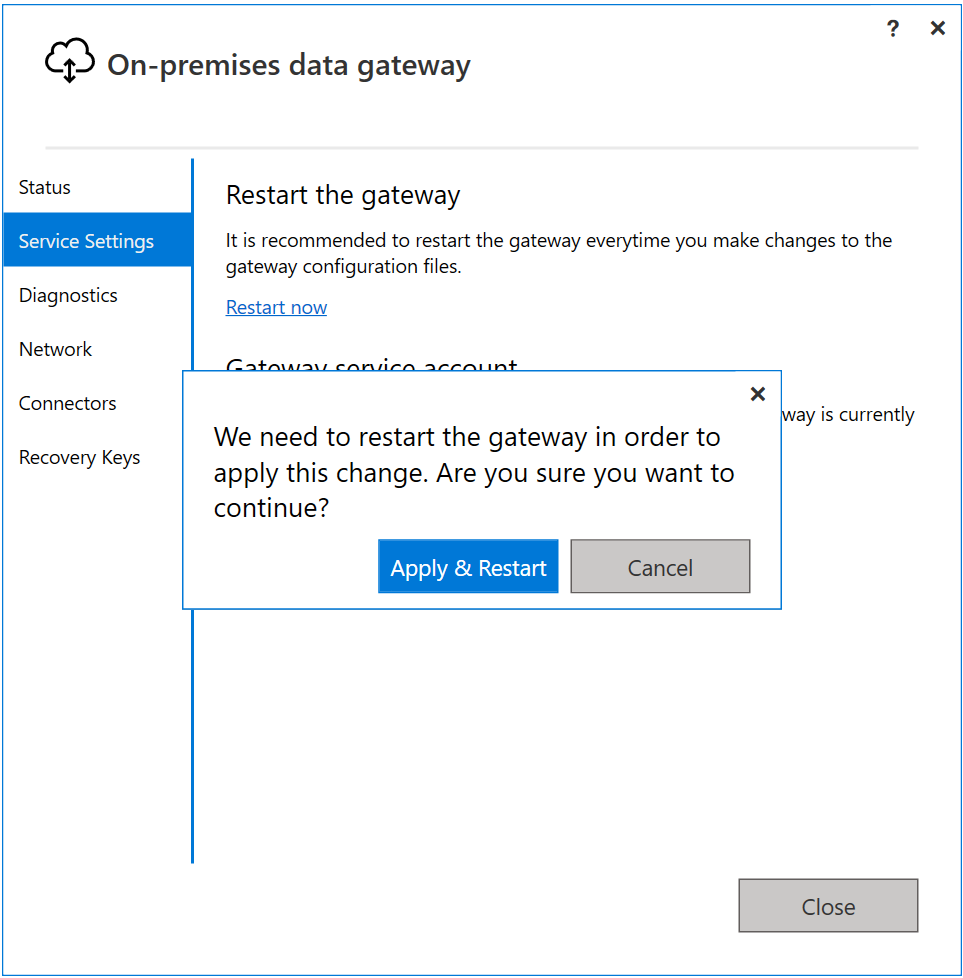
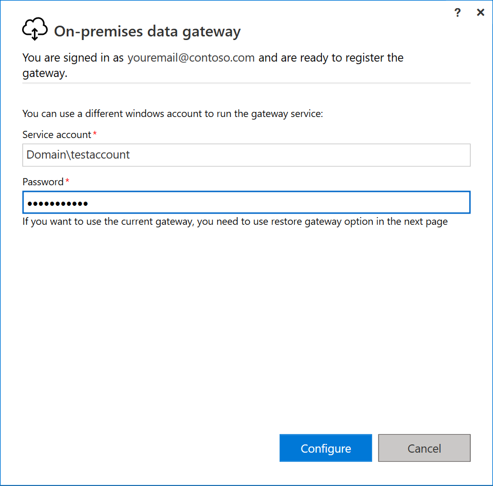
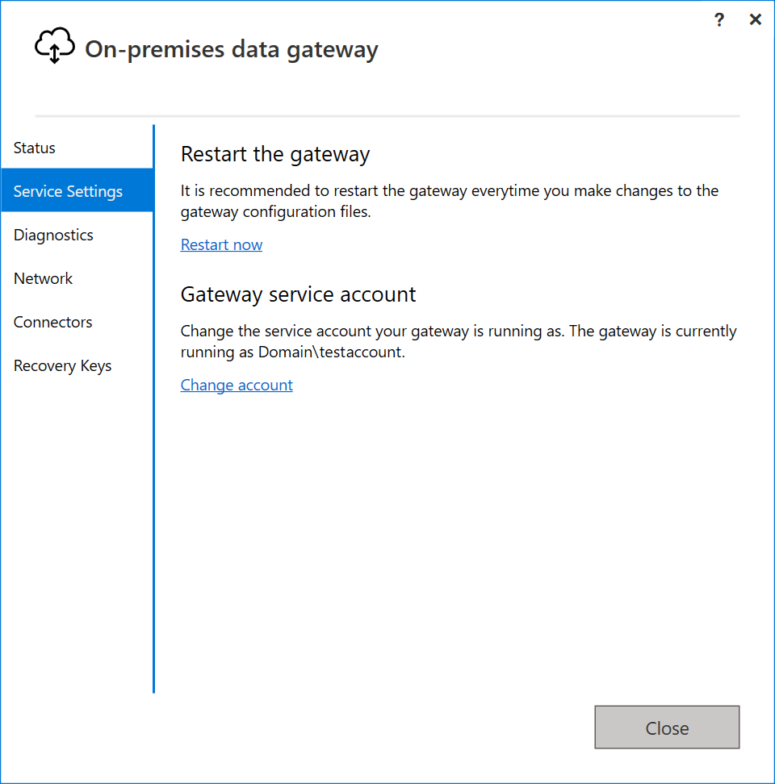

# Change the on-premises data gateway service account

[!INCLUDE [gateway-rewrite](../includes/gateway-rewrite.md)]

The on-premises data gateway is configured to use *NT SERVICE\PBIEgwService* for the Windows service sign-in credential. In the context of the machine on which you install the gateway, the account by default has the right of Log on as a service.

This service account isn't the account used to connect to on-premises data sources. It also isn't the work or school account that you sign in to cloud services with.

## Change the service account

To change the Windows service account for the on-premises data gateway:

1. Open the [on-premises data gateway app](service-gateway-app.md), select **Service settings**, and then select **Change account**.

   

    The default account for this service is *NT SERVICE\PBIEgwService*. Change this account to a domain user account within your Windows Server Active Directory domain, or use a managed service account to avoid having to change the password.

1. Select **Change account**. You need the recovery key to change the service account.

   

1. Provide the service account and password, and select **Configure**.

   

1. Provide your sign in account, and select **Sign in**.

   

1. On the next windows, select **Migrate, restore or takeover an existing gateway**, and follow the process for [restoring](service-gateway-migrate.md) your gateway.

1. After the restoration is complete, the new gateway uses the domain account.

   

## Next steps

* [Set the datacenter region](service-gateway-data-region.md)  
 