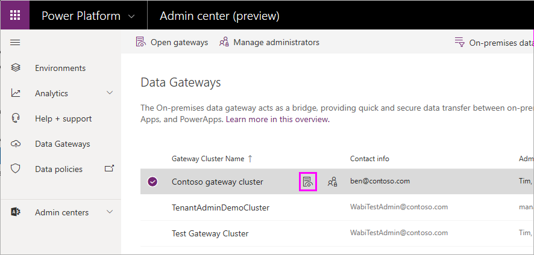
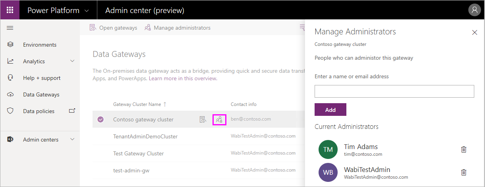
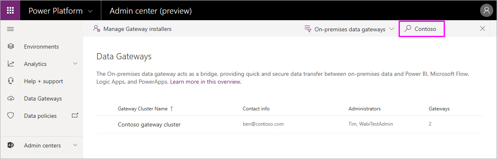

# Tenant level administration

You can use the Power Platform Admin center to get visibility into all on-premises data gateways in a tenant. To do so, sign in as a tenant admin and select the Data Gateway option.

> [!NOTE]
> Only users who are part of the Azure AD tenant Global administrator role (which includes Office 365 Global admins) will see the **Data Gateway** option.

The Gateways page lists all on-premises data gateway clusters installed on the tenant. In addition, you can review the following information about these clusters:

* **Gateway Cluster Name**: The name of the gateway cluster.
* **Contact Info**: Admin contact information for the gateway cluster.
* **Administrators**: The list of gateway administrators.
* **Gateways**: The number of gateway members in the gateway cluster.

## Display gateway members

Select the **Open in new window** icon () next to the gateway cluster name to see the gateway members, device name, and version in each gateway cluster.

## Manage gateway admins

Select the **People** icon () next to the gateway cluster name to see the list of gateway admins. Add or remove gateway admins in the **Manage Administrators** page.

For personal gateways, this would show the owner of the personal gateway and cannot be changed due to the security scope of personal gateways.

## Search

Use Search to find gateway clusters and see their details. You can search for gateway cluster names and contact info, but not administrators.

## Next steps

* [Manage an on-premises data gateway](service-gateway-manage.md)
* [Manage high availability clusters and load balancing](service-gateway-high-availability-clusters.md)
