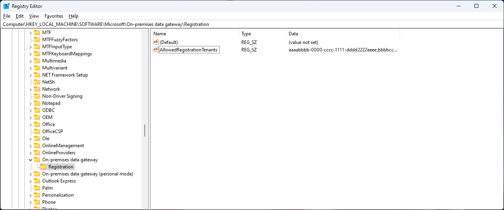
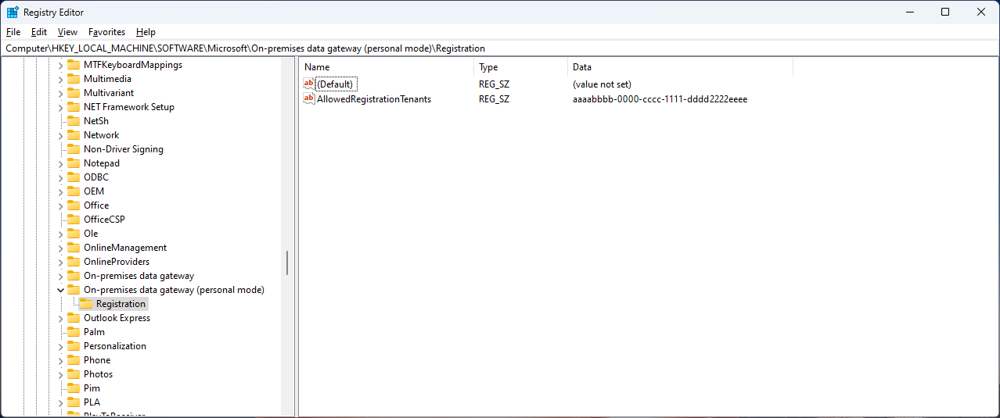

---

title: Manage tenant registration 
description: Learn how to manage which tenants have permissions to register an on-premises data gateway.
ms.reviewer: dougklo
ms.topic: conceptual
ms.date: 11/6/2023
---

# Manage tenants allowed to register an on-premises data gateway

You can use the new tenant restriction settings to control which tenants are allowed to register the on-premises data gateway application. For example, an organization can choose to allow only tenants within the organization to prevent data exfiltration. By default there is no restriction on tenants.

Please be advised that this is a good security measure to take but does not guarantee total data exfiltration protection.

Once you have defined a list of allowed tenants, follow the steps below to add them to the registry for both personal and enterprise gateway versions.

## Restrict the enterprise and personal on-premises data gateway

1. Find your tenant id: How to find your tenant ID: (Microsoft Entra | Microsoft Learn)[https://learn.microsoft.com/en-us/azure/active-directory/fundamentals/how-to-find-tenant].
2. Run the Registry Editor through the Windows start menu (regedit.exe)
3. Navigate to “HKEY_LOCAL_MACHINE\SOFTWARE\Microsoft”.
4. Right click on the Microsoft folder and select New > Key. Create a key named either “On-premises data gateway” for the enterprise gateway, or  'On-premises data gateway (personal mode)", for the personal gateway.
5. Right click on the “on-premises data gateway” folder you just created and select New > Key, again. Name this key “Registration”.
6. Right click on the window to the right and select New > String Value. Name the value AllowedRegistrationTenants (make sure it is plural and everything is spelled correctly). Right click on the AllowedRegistrationTenants value and select Modify. Set its data to a comma separated list of the tenant ids that the machine should allow. Tenants are identified by their TenantID, which is a GUID. The results should appear as in the screenshot below.

   

   

## On-premises data gateway registration tenant settings

When registering the Enterprise gateway, the tenant used to register will be written to “HKEY_LOCAL_MACHINE\SOFTWARE\Microsoft\On-premises data gateway\Registration\RegistrationTenant”.

When registering the personal gateway, the tenant used to register will be written to “HKEY_CURRENT_USER\SOFTWARE\Microsoft\On-premises data gateway (personal mode)\Registration\RegistrationTenant”.

   

## Error associated with using a tenant not in the allow list

If the reg key has been set to limit allowed tenants and a user attempts to register the Gateway with a credential from a tenant which has NOT been specifically allowed, this will generate an error, and the Gateway will fail to register or launch.

In this case, an error will be written to the gateway logs stating “[DM.GatewayServiceHost] Not starting transfer service because ‘onmicrosoft.com’ is not in tenant allow list”. The user will see the error in the picture below stating “You cannot login with this email address. Please contact your tenant administrator for help with allowed registration tenants.” This indicates that the user attempted to register or sign in using a tenant that is not in the tenant registration allow list.

   