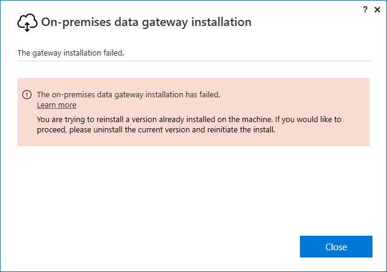
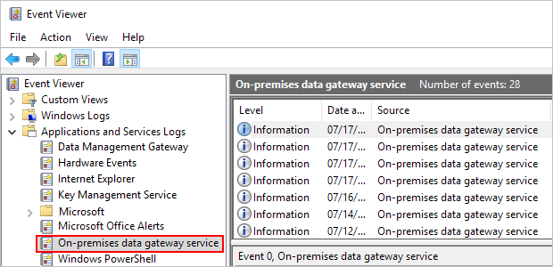

# Troubleshoot the on-premises data gateway

This article discusses some common issues when you use the on-premises data gateway.

>[!NOTE]
>If you encounter an issue that isn't listed here, create a support ticket for the particular cloud service that's running the gateway.

## Update to the latest version

It's a good general practice to make sure you're using a supported version. We release a new update of the on-premises data gateway every month. Currently, Microsoft actively supports only the last six releases of the on-premises data gateway. If you're experiencing issues with the version you're using, try upgrading to the latest one as your issue may have been resolved in the latest version.

### Inconsistent versions between gateway members in a cluster

Keep the versions of the gateway members in a cluster in sync. Having all the same version in a cluster helps to avoid unexpected refresh failures. These refresh failures might occur because the gateway member that a specific query is routed to might not be capable of executing it due to a lower version.

## Troubleshoot Gateway management

Here are a few common management issues and the resolutions that helped other customers.

### Error while removing the primary node of a gateway cluster

The primary node of a gateway can't be removed if there are other members in the cluster. Removing the primary node also means removing the gateway cluster. 

## Troubleshoot common installation issues

Here are a few common installation issues and the resolutions that helped other customers.

### Error: Failed to add user to group. (-2147463168 PBIEgwService Performance Log Users)

You might receive this error if you're trying to install the gateway on a domain controller. Deploying on a domain controller isn't supported. You need to deploy the gateway on a machine that isn't a domain controller.

### Out-of-date antivirus software

You might encounter installation failures if the antivirus software on the installation machine is out of date. You can either update the antivirus installation or disable the antivirus software only for the duration of the gateway installation. After the installation is finished, reenable the antivirus software.

### McAfee Endpoint Defender software enabled

You might encounter installation failure when anitivirus software, like McAfee Endpoint Defender is enabled. Configure your antivirus software to ignore the gateway process.

### Same or older gateway version

You might come across the following error if you try to install the same version or a previous version of the gateway compared to the one that you already have.

### Error: The user profile is a temporary profile

There is an issue with the machine. Contact your internal IT team to remove the temporary profile.

## Troubleshoot configuration

### Firewall or proxy

To test if the gateway has access to all the required ports, run the [network ports test](service-gateway-communication.md#network-ports-test). The results of the test are either Completed (Succeeded) or Completed (Failed, see last test results). If the test succeeded, your gateway successfully connected to all the required ports. If the test failed, your network environment might be blocking these required ports and servers.

For information on how to provide proxy information for your gateway, go to [Configure proxy settings for the on-premises data gateway](service-gateway-proxy.md).

A firewall also might be blocking the connections that the Azure Service Bus makes to the Azure data centers. If that's the case, unblock the IP addresses for your region for those data centers. You can get a list of Azure IP addresses from [this website](https://www.microsoft.com/en-us/download/details.aspx?id=56519). To find the current data center region you're in, go to [Set the data center region](service-gateway-data-region.md).

### Authentication to proxy server

Your proxy might require authentication from a domain user account. By default, the gateway uses a Service SID for the Windows service sign-in user. Changing the sign-in user to a domain user can help with this situation. For more information, go to [Change the gateway service account to a domain user](service-gateway-proxy.md#change-the-gateway-service-account-to-a-domain-user).

### Your proxy only allows ports 80 and 443 traffic

Some proxies restrict traffic to only ports 80 and 443. By default, communication to Azure Service Bus occurs on ports other than 443.

You can force the gateway to [communicate with Azure Service Bus by using HTTPS](service-gateway-communication.md#force-https-communication-with-azure-service-bus) instead of direct TCP.

### Gateway proxy unable to connect to Managed Data Lake

If you're using a proxy to access on-premises data using an on-premises data gateway, you might not be able to connect to a managed data lake (MDL) using the default proxy settings. To connect to MDL, be sure to add addresses `*.dfs.core.windows.net` and `*.blob.core.windows.net` to the allowlist on your proxy server.

### System performance counters data is unavailable 

If the current service account which is being used by the on-premises data gateway application is not a member of the local security group "Performance Log Users" you may observe in the [System Counter Aggregation Report](service-gateway-performance.md), that only system memory usage value is available.

To address this behavior, please make sure you add the on-premises data gateway service account to the local security group "Performance Log Users", and restart the on-premises data gateway service.

### Common errors

#### Error: Failed to create a gateway. Try again.

This error could be due to proxy configuration issues. The gateway log provides additional details for troubleshooting. For more information, go to [Configure proxy settings for the on-premises data gateway](service-gateway-proxy.md).

#### Error: Power BI service reported local gateway as unreachable. Restart the gateway and try again.

At the end of configuration, the Power BI service is called again to validate the gateway. The Power BI service doesn't report the gateway as *live*. Restarting the Windows service might allow the communication to be successful. To get more details, collect and review the logs, as described in the following section.

#### Error: Information is needed in order to combine data

You may experience a refresh failure in Power BI service with an error "Information is needed in order to combine data", even though refresh on Power BI Desktop works. This problem occurs when the refresh in Power BI Desktop works with the **File** > **Options and settings** > **Options** > **Privacy** > **Always ignore privacy level settings** option set, but throws a firewall error when other options are selected. If you attempt to preform this refresh in Power BI service, the refresh won't work because **Always ignore privacy level settings** isn't available in Power BI service. To resolve this error, try changing the privacy level in the Power BI desktop **Options** > **Global** > **Privacy** and **Options** > **Current File** > **Privacy** settings so that it doesn't ignore the privacy of data. Republish the file to Power BI service and update the credentials to "Organizational" in Power BI service.

#### Error: There are too many refreshes occurring concurrently.

The gateway has a concurrency limit of 30. If you're getting this error, it means you reached the concurrency limit. You can monitor the concurrency count with the [gateway diagnostics template](service-gateway-performance.md). To avoid running into this issue, upgrade the number of gateways in a cluster or start a new cluster to load balance the request.

## Troubleshooting tools

### Collect logs from the on-premises data gateway app

There are several logs you can collect for the gateway, and you should always start with the logs. The simplest way to collect logs after you install the gateway is through the [on-premises data gateway app](service-gateway-app.md). In the on-premises data gateway app, select **Diagnostics** and then select the **Export logs** link, as shown in the following image.

This file is saved to the ODGLogs folder on your Windows desktop in .zip format.

### Event logs

To find the event logs for the *on-premises data gateway service*, follow these steps: 

1. On the computer with the gateway installation, open the **Event Viewer**.

1. Expand **Event Viewer** > **Applications and Services Logs**.

1. Select **On-premises data gateway service**.

## Limitations and considerations

The Power BI [gateways REST APIs](/rest/api/power-bi/gateways) don't support [gateway clusters](service-gateway-high-availability-clusters.md).

## Next steps

* [On-premises data gateway ](service-gateway-onprem-faq.yml)

[!INCLUDE[footer-include](../includes/footer-banner.md)]
