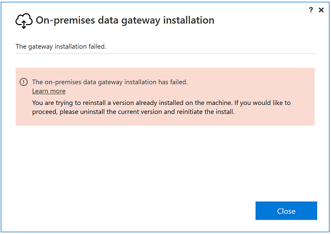
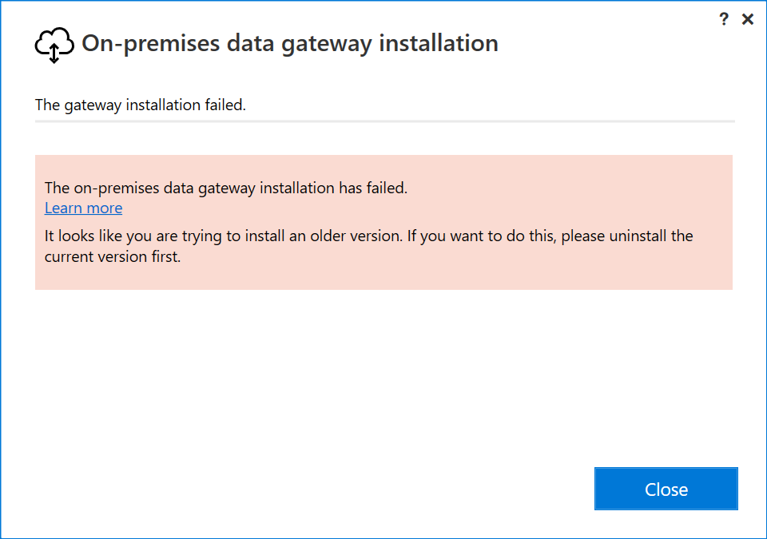
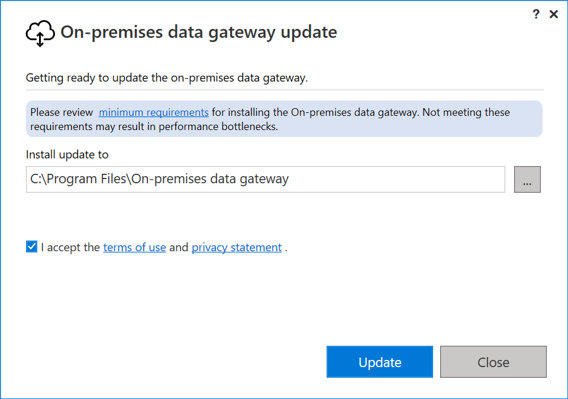
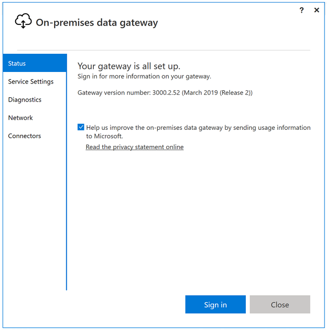
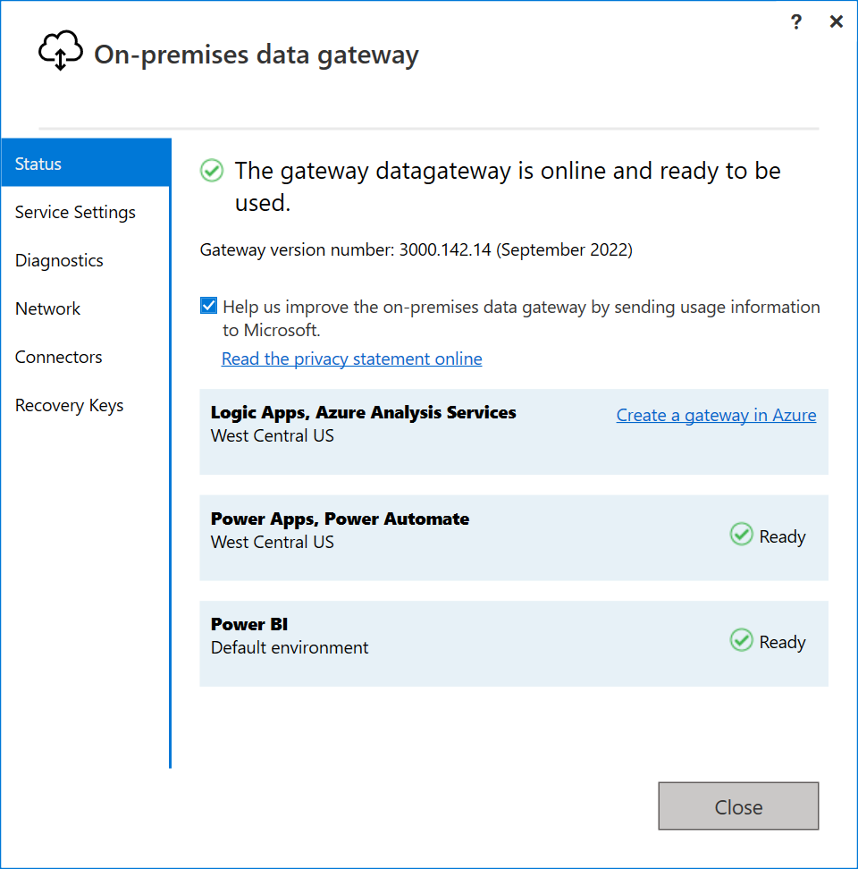

# Update an on-premises data gateway

We aim at releasing an update every month for on-premises data gateways. Each of these updates includes new features along with the latest mashup update.

> [!NOTE]
> If you are running a gateway cluster, we recommend that you update all nodes in the cluster at the same time.

To update an on-premises data gateway:

1. Download the [latest gateway](https://go.microsoft.com/fwlink/?LinkId=820925&clcid=0x409) and run the installation. If the version you're trying to install is the same or older than the version on the machine, then you'll receive one of the respective error messages.

   

   

2. If you install a more recent version, you'll be prompted to update. Select the **Update** button to begin updating.

   

3. Once the installation is completed, select the **Sign in** button.

   

The on-premises data gateway update is now complete.

