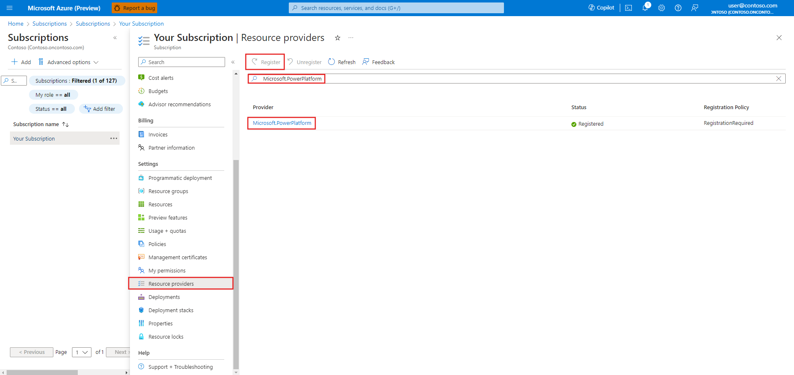
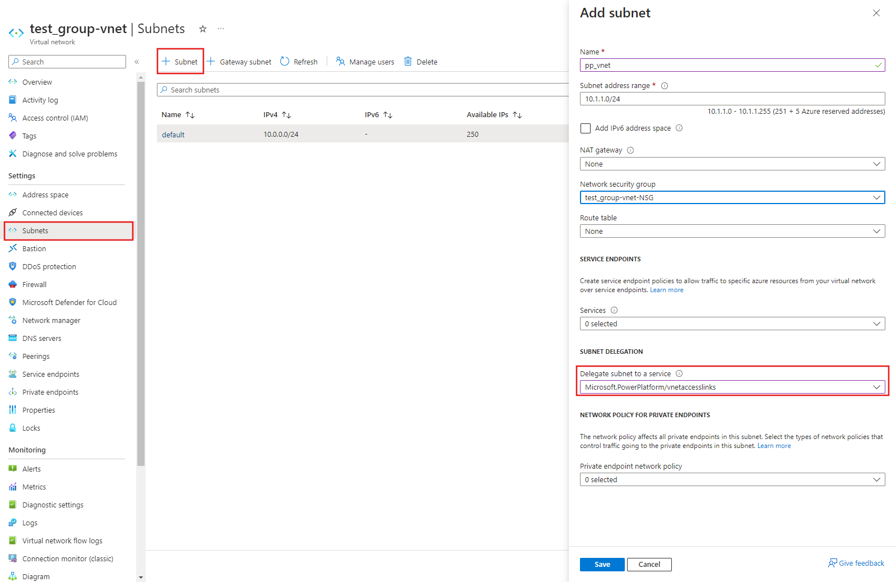
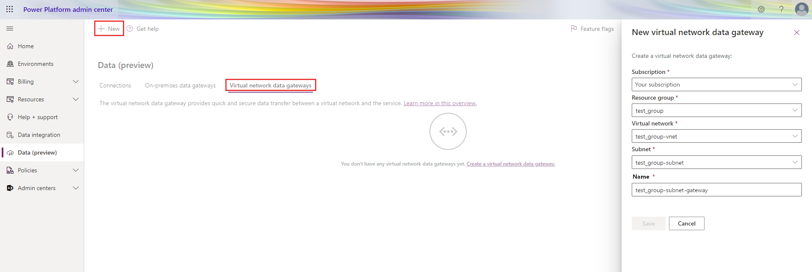

# Create virtual network data gateways

Details to consider when creating a VNet data gateway:
- Before creating a VNet data gateway, check that the feature is [supported in your region](#regions-supported-for-vnet-data-gateways).
- The creation of VNET data gateways across tenant boundaries isn't supported.
- The metadata (name, details, data sources, encrypted credentials, and so on) for all your VNet data gateways are stored in your Power BI home’s default region. However, the VNet data gateway runs in the same region as your Azure VNet. Sometimes, there's a difference between the default environment of Power Platform and the default region of Power BI. This might impact the regions you pick.

Creating a virtual network (VNet) data gateway is a three-step process:

> [Step 1: Register Microsoft.PowerPlatform as a resource provider](#step-1-register-microsoftpowerplatform-as-a-resource-provider)

> [Step 2: Associate the subnet to Microsoft Power Platform](#step-2-associate-the-subnet-to-microsoft-power-platform)

> [Step 3: Create a VNet data gateway](#step-3-create-a-vnet-data-gateway)

## Step 1: Register Microsoft.PowerPlatform as a resource provider

On the Azure portal, sign in as a subscription owner and register `Microsoft.PowerPlatform` as a resource provider for the subscription that contains the VNet. This change enables your subscription to work with this resource provider.

1. Sign in to the [Azure portal](https://portal.azure.com).

1. Navigate to the specific subscription.

1. Select **Resource providers**.

1. Search for and select **Microsoft.PowerPlatform**, and then select **Register**.

    

## Step 2: Associate the subnet to Microsoft Power Platform

A user in a role with the Microsoft.Network/virtualNetworks/subnets/join/action permission on the VNet, like the Azure [Network Contributor](/azure/role-based-access-control/built-in-roles#network-contributor) role, can delegate the subnet within the same VNet to Microsoft Power Platform. Subnet delegation enables you to designate a specific subnet for an Azure PaaS service of your choice that needs to be injected into your virtual network.

This subnet should have connectivity to the data service.

1. Sign in to the [Azure portal](https://portal.azure.com).

1. [Add a new subnet](/azure/virtual-network/virtual-network-manage-subnet#add-a-subnet) in the VNet. This new subnet can't be shared with other services, but will be used entirely by the Power Platform VNet service. Five IPs on this subnet will be reserved for basic functionality. In addition to those five, reserve one IP for every other gateway member you plan to create. For example, if you plan to have 2 clusters of 3 gateway members each, you would want a total of 2 x 3 + 5 or 11 IPs in the subnet CIDR range. It's a good idea to add more IPs for future gateways.

The gateways within each cluster need to be able to communicate. For this reason, if you are restricting the allowed IPs the delegated subnet can communicate with, do not block the subnet IP range itself. 

    > [!NOTE]
    >
    > * Don't use the subnet name "gatewaysubnet" as this is a reserved word for the Azure Gateway Subnet feature. You won't be able to use it to create a VNet data gateway in Step 3.
    > * Make sure this subnet doesn't have an IPV6 address space added.
    > * Make sure the subnet's IP range doesn't overlap with 10.0.1.x.

1. Select **Resource providers**.

1. Select **Microsoft.PowerPlatform/vnetaccesslinks** from the subnet delegation drop-down list.

1. Select **Save**.

    

## Step 3: Create a VNet data gateway

A Microsoft Power Platform user enables the subnet for use in Microsoft Power Platform and creates a VNet data gateway. By doing this process, the user authorizes the Microsoft Power Platform VNet service to inject containers into the subnet. The user also needs to have the Azure [Network Contributor](/azure/role-based-access-control/built-in-roles#network-contributor) role in the subscription to be able to perform this action.

1. Sign in to the [Power Platform admin center](https://admin.powerplatform.microsoft.com).

1. In the left navigation pane, select **Data (preview)**.

1. Select **Virtual network (VNet) data gateway** > **New**.

1. Select the subscription, resource group, VNet and the Subnet. Only subnets that are delegated to Microsoft Power Platform are displayed in the drop-down list.

1. By default, we provide a unique name for this data gateway, but you could optionally update it.

1. Select **Save**. This VNet data gateway is now displayed in your **Virtual network data gateways** tab. A VNet data gateway is a managed gateway that could be used for controlling access to this resource for Power platform users.  

    

## Regions supported for VNet data gateways

Your Azure VNet region needs to be in one of the following regions for you to be able to create a virtual network (VNet) data gateway:

* Australia East
* Australia Southeast
* Brazil South
* Canada Central
* Central India
* Central US
* East Asia
* East US
* East US 2
* France Central
* Germany West Central
* Japan East
* Korea Central
* North Central US
* North Europe
* Norway East
* South Africa North
* South Central US
* Southeast Asia
* Switzerland North
* UAE North
* UK South
* West Central US
* West Europe
* West India
* West US
* West US 2

### See also

[Manage virtual network data gateways](manage-data-gateways.md)
