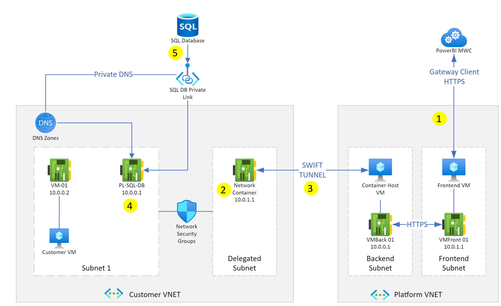

# Virtual network data gateway architecture

The virtual network (VNet) data gateway facilitates secure connectivity to data sources associated with your VNet.

Users in your organization can access data secured by a VNet to which they already have access. But before these users can connect to these data sources from Microsoft Cloud services, a VNet gateway needs to be [registered and configured](create-data-gateways.md).

Let's first look at what happens when you interact with a Power BI report that's connected to a data source within a VNet.

1. Power BI cloud service (or one of the other supported cloud services) kicks off a query and sends the query, data source details, and credentials to the Microsoft Power Platform VNet service.

2. The Microsoft Power Platform VNet then securely injects a container running the VNet data gateway into the subnet. This VNet data gateway can now connect to data services accessible from within this subnet.

3. The Microsoft Power Platform VNet service then sends the query, data source details, and credentials to the VNet data gateway.

4. The VNet data gateway gets the query and connects to the data sources with those credentials.

5. The query is then sent to the data source for execution.

6. After execution, the results are sent to the VNet data gateway and the Microsoft Power Platform VNet service securely pushes the data from the container to the cloud service.

Here's a network diagram illustrating the data pathway between Power BI cluster and a SQL database data source:

When the workload starts up, the VNet data gateway leases an IP from the delegated subnet, which means it's obeying the network security group (NSG) and network address translation (NAT) rules on the target VNet. Traffic going through this IP address obeys all NSG rules that are applied to the subnet.

The VNet gateway doesn't require any Service Endpoint or open ports back to Power BI. Data from the VNet is returned to Power BI by the SWIFT tunnel, which is an Automatic Private IP Addressing (APIPA) feature existing on the infrastructure virtual machine.

> [!NOTE]
> All traffic uses the Azure backbone, including the Swift tunnel.

# Hardware

Each instance of the VNet data gateway has a maximum capacity of:
  * 2 cores
  * 8GB of RAM each

At this time, this is the only available hardware configuration and it can't be scaled or changed.
