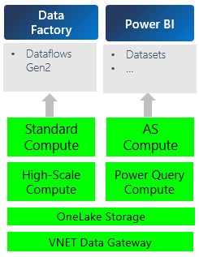

# Virtual network data gateways business model
Data Gateway. The virtual network data gateway is a network security offering that lets you connect your Azure and other data services to Microsoft Fabric and the Power Platform. You can run Dataflow Gen2, Power BI Semantic Models, Power Platform Dataflows, and Power BI Paginated Reports on top of a virtual network data gateway. The virtual network data gateway ensures no traffic is exposed to a public endpoint. In addition, you can force all traffic to your datasource to go through a gateway, allowing for comprehensive auditing of secure data sources. To learn more and get started, refer to [virtual network data gateways](overview.md).

## Summary

The virtual network data gateway is billed as an additive premium infrastructure charge, billed to a Premium or Fabric capacity. This means that it has its own meter and incurs a bill that is consistent across and in addition to all artifacts. Total Bill of running an artifact through the virtual network data gateway = artifact charge + virtual network data gateway Charge.

The virtual network data gateway Charge is proportional to your usage of the virtual network data gateway; we define usage as uptime, or anytime the virtual network data gateway is on. A single virtual network data gateway uses two cores. The CU consumption rate is a fixed rate that we decide, depending on what we want to charge. Learn more about CUs [here](/fabric/enterprise/fabric-operations).

- Consumption Unit (CU) consumption rate: 2x
- Price: 2x (CU Consumption rate) * 2 cores (per virtual network data gateway) * $0.18 (Pay as You Go price for one CU per hour) = $0.72 per VNET/hour

## Best Practices

You can set up your virtual network data gateways for free. There's no cost associated with setting up a virtual network data gateway. You can set up connections today for free. We start to bill when your first query runs or you run a test connection.

To reduce costs, you can actively manage the time to live on your virtual network data gateway in settings. Learn more [here](manage-data-gateways.md#manage-settings).

To check if your virtual network data gateway is on or off, you can use the status icon on the **Manage connections and gateways** page.

## Example Charges on your capacity
The table below summarizes the bill you can expect from using a single virtual network data gateway for the designated amount of time.

|Time the VNET is on |Calculation	|Charge on capacity |
|--------------------|------------|-------------------|
|h hours	|2 * 2 * 0.18 * h	|$0.72h |
|30 minutes	|2 * 2 * 0.18 * 0.5 hours	|0.36 |
|1 hour	|2 * 2 * 0.18 * 1 hour	|0.72 |
|2 hours	|2 * 2 * 0.18 * 2 hours	|1.44 |
|8 hours	|2 * 2 * 0.18 * 8 hours	|5.76 |
|24 hours	|2 * 2 * 0.18 * 24 hours	|17.28 |

## View and Manage your Bill
Virtual network data gateways don't map to a single workspace or artifact. Rather, each gateway incurs a single charge on the capacity that encompasses the uptime of all the other artifacts and workspaces using it to connect to data sources.
If you're using a Fabric capacity, the bill shows up as its own line item in the Fabric Capacity Metrics app with the artifact and workspace name as _Virtual Network Data Gateway_.
In the following picture, each box represents a different meter. A meter keeps track of the bill incurred for whichever service it maps to. For example, the Power Query Compute box represents a meter that tracks the compute used by the Mashup Engine to execute M queries.

If you're using a Premium Power BI capacity, you can learn more about how to view and manage your bill [here](/power-bi/enterprise/service-admin-premium-manage#manage-capacity).
