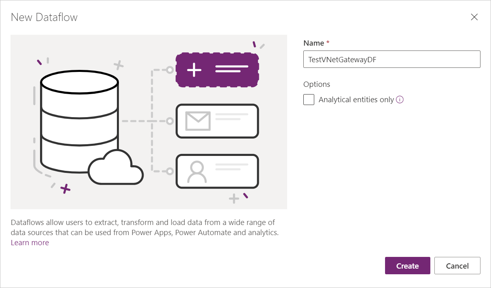
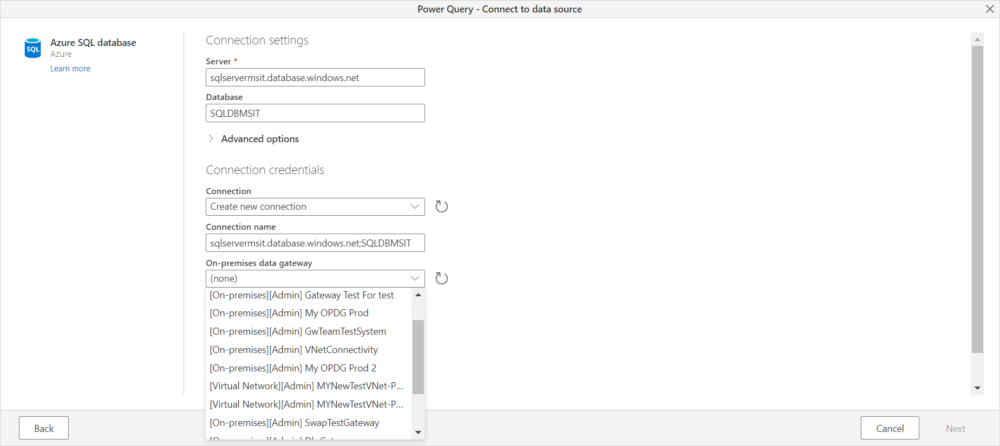
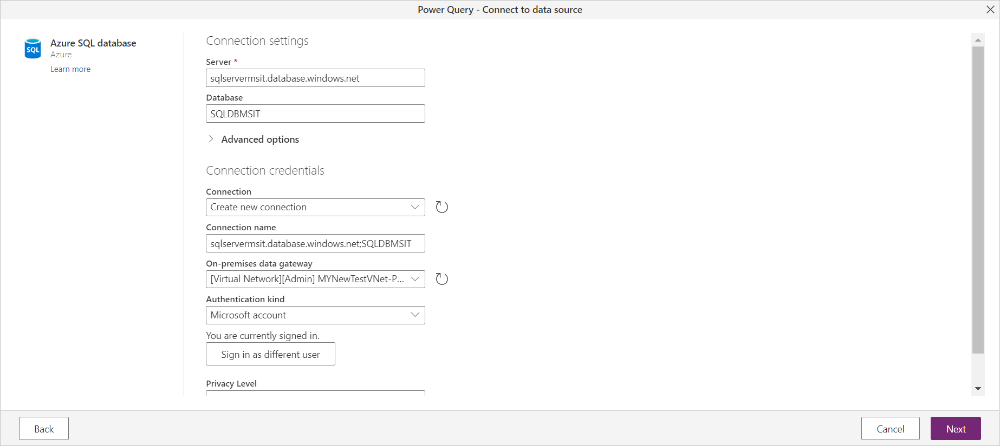
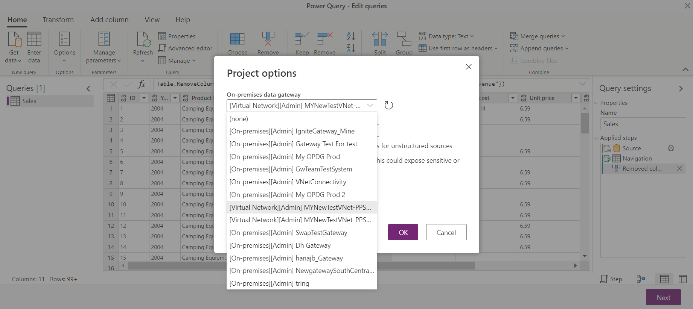

# Use virtual network (VNet) data gateway in Power Platform dataflows

Virtual network data gateways let Power Platform dataflows connect to data services secured in an Azure VNet without the need of an on-premises data gateway. For more information about virtual network data gateways and their limitations, go to [What is a virtual network (VNet) data gateway](what-is.md).

>[!Note]
>
>* For Power Platform dataflows, this feature currently doesn't support the ability to write to a privatized data lake or Dataverse.

## Connect to data using a VNet data gateway

To connect to data using a VNet data gateway:

1. Create a new dataflow on the Power Apps maker portal. More information: [Create and use dataflows in Power Apps - Power Apps](/powerapps/maker/data-platform/create-and-use-dataflows)

   

2. Once you provide the connection details and then connect to data, the VNet data gateways are now included in the **On-premises data gateway** selections.

   

3. Select a VNet data gateway, choose an authentication kind, and then select **Next** to connect and continue with transforming data.

   

You can also update VNet data gateway details just like you do for an on-premises data gateway. In the Power Query editor, select **Home** > **Options** > **Project options** while editing your dataflow.

   

## Supported data sources

Power Platform dataflows support the same data sources that Power BI does. For a list of supported data sources, go to [Power BI supported data sources](use-data-gateways-sources-power-bi.md#supported-azure-data-services).
