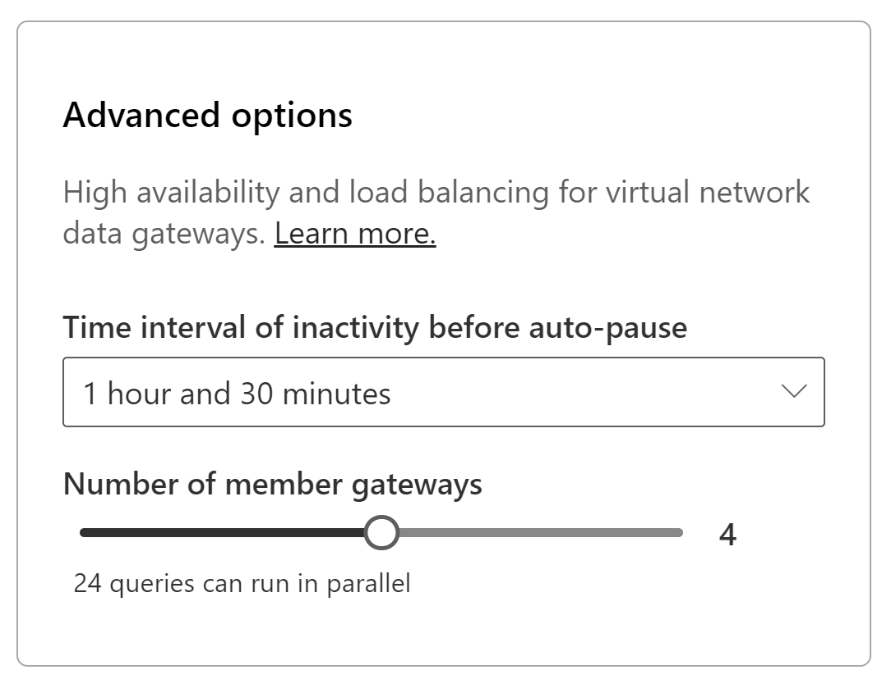

# Manage virtual network data gateway high availability and load balancing

You can use a cluster of virtual network data gateways to load balance the queries executing on the cluster and to avoid a single point of failure.

## High-availability and load balancing a cluster for a virtual network data gateway

You can create high-availability clusters when creating a new virtual network data gateway. Having multiple gateways in the cluster ensures that your organization can access your data behind the virtual network and avoid a single point of failure when accessing on-premises data resources. A cluster with multiple gateways also allows for load balancing. The selection of a gateway during load balancing is random.

## How to create a cluster of multiple virtual network data gateways

There are two ways to create a cluster of virtual network data gateways. The first one is to directly create a cluster with multiple gateways during the first-time creation of the data gateway. The second option is to edit the settings for existing virtual network data gateways.

If you're creating a new virtual network data gateway, you first need to fill out the required information for creating the virtual network from the Power Platform admin center. Afterwards, you're presented with an advanced options menu.

By default, the number of gateways is set to 1. This setting means that only one gateway will be created. You can increase the number of gateways by using the slider. The maximum number of gateways per cluster is 5.

## How to ensure your gateway is available for query execution

The virtual network data gateway cluster auto-pauses after a certain time of inactivity. After the gateway is auto paused, it takes about 2 to 3 minutes for the cluster to become available again. By default, the time interval of inactivity before auto-pause is set to 30 minutes. You can increase this time interval to a maximum of 24 hours. There's no support for leaving the virtual network data gateway cluster always on.

## How to change the high availability options

At any point in time, you can change the number of gateways you have in the cluster. You can also change the time interval of inactivity before auto pause. To edit these settings, select a virtual network data gateway, and then select **Settings** on the top. You can now change the advanced options on the **Settings** panel.

