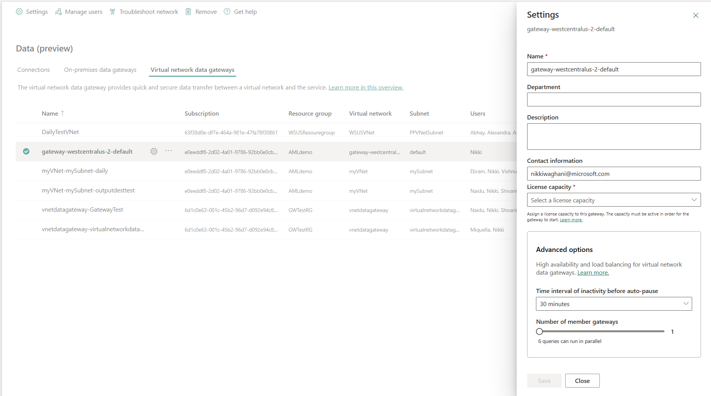
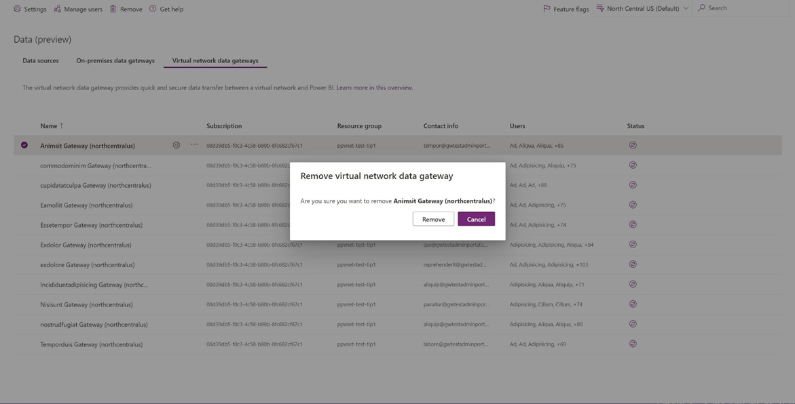

# Manage virtual network data gateways

After you've [created](create-data-gateways.md) a virtual network (VNet) data gateway, it will be available in the **Data (preview)** > **Virtual network data gateways** tab in the [Power Platform admin center](https://admin.powerplatform.microsoft.com) for you to manage. Also make sure you select your tenant's default home region in the region dropdown to display and manage all your VNet data gateways. You select your tenant's default region because the metadata (name, details, data sources, encrypted credentials, and so on) for all your VNet data gateways are stored in your tenant's default region.

> [!NOTE]
> The **Virtual network data gateways** tab won't be visible when the **Tenant Administration** toggle is turned on.

## Manage access to creating VNet data gateways (gateway installer setting)

Access to creating a VNet data gateway can be limited to selected people only. To do this limitation, you must be an Azure AD Global administrator (which includes Global admins) or a Power BI service administrator. Use the **Manage gateway installers** option to manage who can create a VNet data gateway in your enterprise. This operation isn’t available for gateway admins. Go to the [manage gateway installers](/power-platform/admin/onpremises-data-gateway-management#manage-gateway-installers) documentation to learn more.

## Manage admins

You can manage admins for this VNet data gateway like you do for standard data gateways in the Power Platform admin center. To add or remove admins, select a gateway, and then select **Manage Users**.

## Manage capacity for billing

The capacity linked to your VNet data gateway will incur the bill. You can view and edit this capacity in the [settings](https://learn.microsoft.com/en-us/data-integration/vnet/manage-data-gateways#manage-settings) for the gateway. Fabric and Power BI capacities are valid.

> [!NOTE]
> All gateways require an active capacity to be assigned to be used. Gateways without a capacity assigned will not be usable or editable. Exisitng preview users are required to assign a capacity to each of their existing gateways in order to continue using them after February 1st, 2024.

## Manage settings

You can view properties for a selected VNet data gateway in the Power Platform admin center by selecting **Settings**.

## Remove VNet data gateways

You can remove or delete VNet data gateways by selecting the gateway and selecting **Remove**.

> [!NOTE]
> When you remove the last gateway associated to a gateway/subnet, it might take up to 48-72 hours before you can delete the subnet or VNet.

>[!Important]
> To be able to remove or delete a VNet data gateway, you need to:
>
> * Be a gateway admin of the VNet data gateway you want to remove
> * Have the Azure Network Contributor role in the Azure portal
> * Register the Microsoft.PowerPlatform provider as a resource provider

