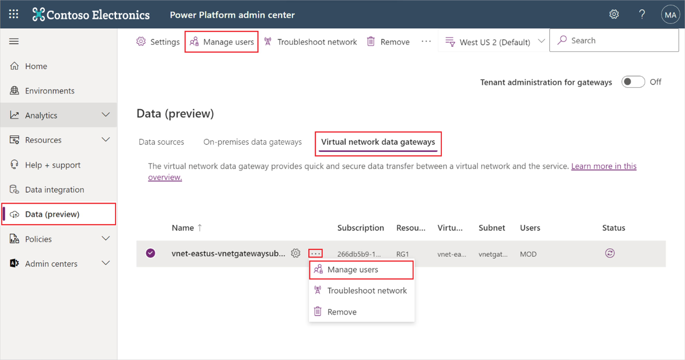
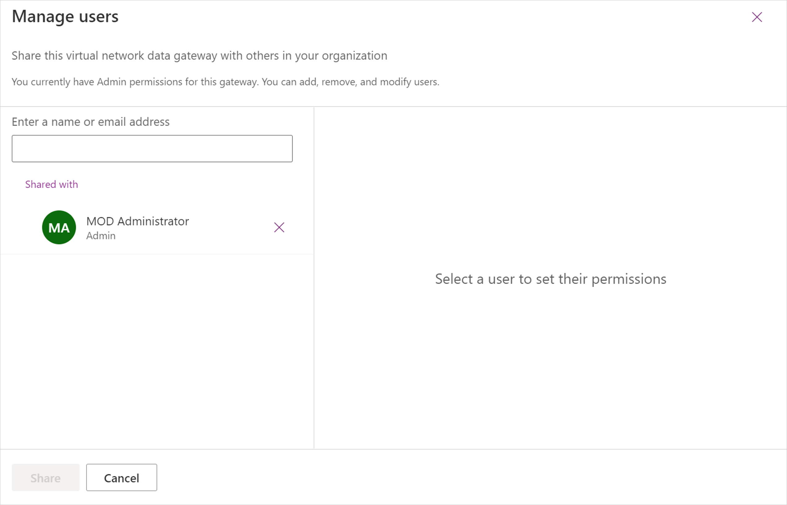

# Manage security roles of a VNet data gateway

You can use the VNet data gateway to transfer data quickly and securely between Power BI or Power Power Platform and a data source, such as Azure Databricks or Snowflake. From the Power BI manage gateways page, you can also view all VNet data gateways for which you have permissions and manage data sources for those gateways.

## VNet data gateways and data source permissions

### User roles

There are three security user roles available for the VNet data gateway. When you create a VNet data gateway, you automatically become the admin of the gateway. There can be multiple admins on the gateway.

>[!NOTE]
>The user roles for the VNet data gateway are the same as for the on-premises data gateway.

The three security roles for the VNet data gateway are:

* **Admin**: An admin can manage and change the settings of the VNet data gateway. An admin is allowed to create connections (to data sources) on the gateway, manage (add/delete) any users, manage access to all connections created on the gateway, and use all features applicable to gateways, including checking gateway status and using the network troubleshooting pane.
* **Connection creator**: A connection creator is allowed to create connections/data sources on the gateway. A connection creator can also test the status of the gateway cluster and its members. A connection creator gets read-only access to gateway settings, can't add or remove others on the gateway, and can’t remove gateways.
* **Connection creator with resharing**: A connection creator with resharing is allowed to create connections/data sources on the gateway and share gateways with others. Those they share gateways with will have the connection creator permission. They aren't allowed to remove a user from the gateway. Connection creators with resharing can also test the gateway status and use the network troubleshooting pane.

### Connection roles

When you create a connection (data source) with the VNet data gateway, you become the owner of the connection (data source). Multiple owners are allowed.

The three connection roles are:

* **Owner**: The owner of the connection (data source) is allowed to update credentials. An owner can also delete the connection. An owner can assign others to the connection with Owner, User, or User with sharing permissions.
* **User**: A user is allowed to use the connection (data source) in Power BI reports and Power BI dataflows, or in Power Apps. A user isn't allowed to see or update credentials.
* **User with sharing**: A user with sharing is allowed to use the connection (data source) in Power BI reports and Power BI dataflows, or in Power Apps. A user with sharing is allowed to share the data source with others with User permission.

These roles are identical to the on-premises data gateway.

## How to manage the gateway and connection (data source) roles

To manage VNet data gateways:

1. Navigate to the [Power Platform admin center](https://admin.powerplatform.microsoft.com/ext/DataGateways).
2. Select the **Virtual network data gateways** tab.
3. Select a gateway cluster.
4. In the top ribbon or from the three dot menu drop down, select **Manage users**.

   

5. Depending on your role, you can now assign users to the gateway.

   

To manage data sources, follow the guidance in [how to manage on-premises data gateway data sources](/data-integration/gateway/manage-security-roles#:~:text=To%20manage%20data%20sources%3A).
