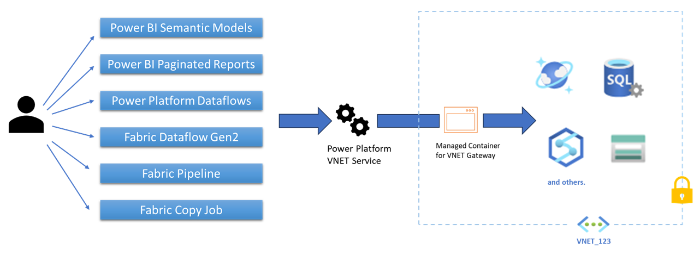

# What is a virtual network (VNet) data gateway (Preview)?

The virtual network (VNet) data gateway helps you to connect from Microsoft Cloud services to your Azure data services within a VNet without the need of an on-premises data gateway. The VNet data gateway securely communicates with the data source, executes queries, and transmits results back to the service.

## Limitations

- Currently, this feature is available only for Power BI datasets and Power Platform dataflows.
- This feature is currently not supported in sovereign clouds.
- Due to an AAD limitation you might see failures when the following settings are enabled together:
  - Service Endpoint for AAD is enabled on the delegated VNet
  - Conditional Access Policies are enabled for the tenant

  To overcome this AAD limitation, you can try the following workaround:
  - If you have VNet traffic blocked by a Conditional Access policy, check your Azure AD sign-in log. Once you’ve identified the traffic, you can get the IPv6 address being used and exclude it from your policy. More information: [Location condition in Azure Active Directory conditional access](/azure/active-directory/conditional-access/location-condition#when-will-my-tenant-have-ipv6-traffic)

- You can't change the region, subscription, or resource group for the VNet on which the VNet data gateway was created. This scenario isn't currently supported.

- Power BI datasets:

  - A list of supported data services for Power BI datasets is available in [Supported Azure data services](use-data-gateways-sources-power-bi.md#supported-azure-data-services).

- Power Platform dataflows:

  - For Power Platform dataflows, this feature currently doesn't support the ability to write to a privatized data lake or Dataverse.
  - A list of supported data sources for Power Platform dataflows is available in [Supported data sources](data-gateway-power-platform-dataflows.md#supported-data-sources).
  - VNet data gateways are created in your tenant’s home region by default and there's currently no option to change the VNet data gateway region. Based on this limitation, VNet data gateways can only be used in Power platform environments in the home region of your tenant.
  - VNet data gateways currently support only admin roles and not "Can Use and Can Use+Share" for Power Platform dataflows.

- Power BI paginated reports:
  - Although VNet gateways support paginated reports, Azure Active Directory (Azure AD) SSO connections aren't supported.
  - A list of supported data sources for Power Platform dataflows is available in [Supported data sources for Power BI paginated reports](/power-bi/paginated-reports/paginated-reports-data-sources).
