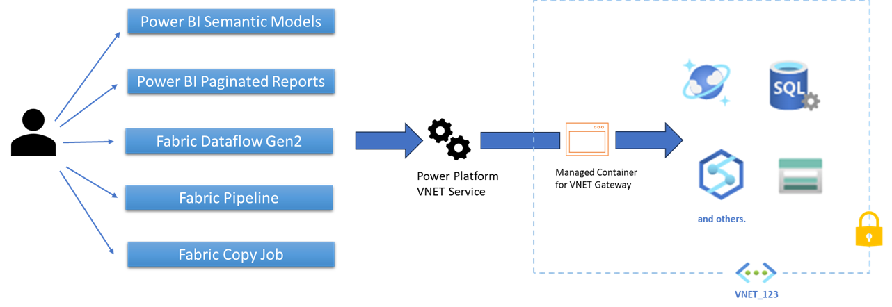

# What is a virtual network (VNet) data gateway (Preview)? 

The virtual network (VNet) data gateway helps you to connect from Microsoft Cloud services to your Azure data services within a VNet without the need of an on-premises data gateway. The VNet data gateway securely communicates with the data source, executes queries, and transmits results back to the service. 

## Limitations
- Currently, this feature is available only for Power BI datasets
- List of supported data services is available here: [Supported Azure data services](use-data-gateways-sources-power-bi.md#supported-azure-data-services)

