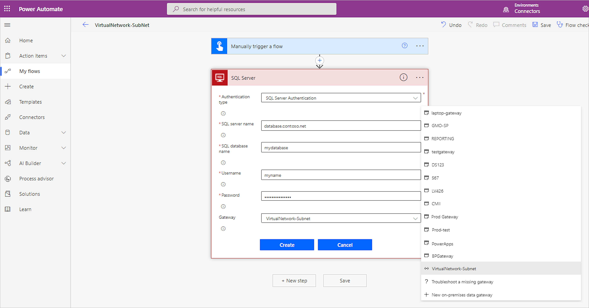
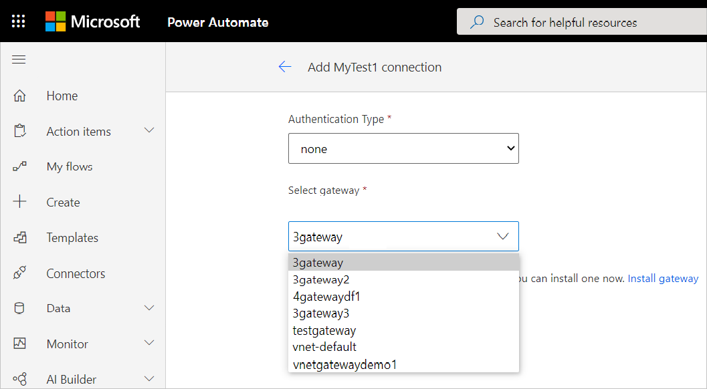
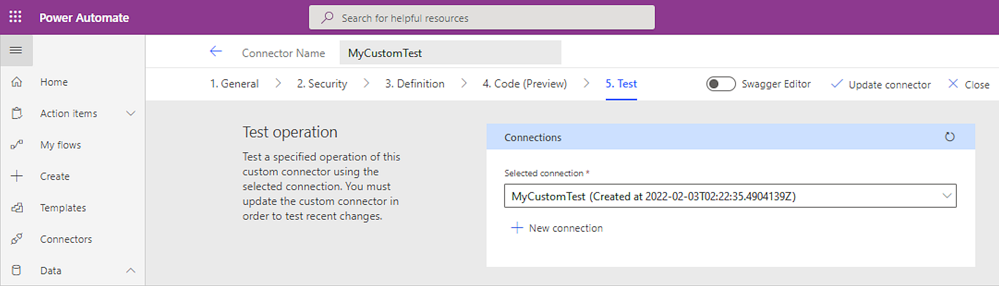
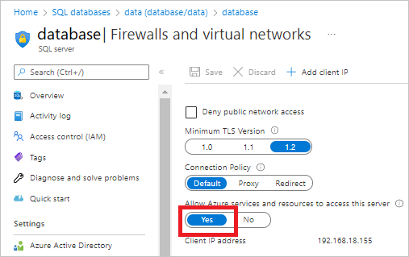

# VNet data gateway support for Power Automate SQL Server and custom connectors (Preview)

The virtual network (VNet) data gateway helps you to connect Microsoft Cloud services to your Azure data services within a VNet without the need of an on-premises data gateway. VNet data gateway is an alternative data gateway and can be used for most of the connectors that support gateway functionality today. The VNet data gateway securely communicates with the connectors and transmits results back to the service. VNet data gateways are created in your tenant’s home region by default and there's currently no option to change the VNet data gateway region. Based on this limitation, VNet data gateways can only be used in Power Automate environments in the home region of your tenant.

We will be working on direct VNet functionality soon, which can be used to connect to cloud resources and will support AAD authentication.

Steps to set up a virtual network data gateway are listed at [Create virtual network data gateways](create-data-gateways.md).

## Power Automate SQL Server connector

When creating the SQL Server connection, choose the VNet data gateway that you created in the Power Platform admin center in the **Gateway** drop down box, as shown in the following image. The Azure SQL server should be in the same virtual network as the VNet data gateway.

Only SQL server authentication is supported for the SQL Server connector. Windows Authentication isn't supported because the VNet data Gateway can't impersonate the Windows user as it's not domain joined.

For an on-premises SQL server, the SQL server must be in the same virtual network as the VNet data gateway. If the firewall is blocked on the virtual machine that the SQL server resides on, you might have to unblock the firewall for the required ports.

## Power Automate custom connectors

When testing the custom connector, create a **New connection** from the **Test** tab by editing the custom connector. Then in the **Select gateway** drop down box, select the VNet data gateway.

Only basic authentication, no authentication, and Windows authentication are supported through the VNet data gateway for custom connectors.

>[!Note]
>Make sure that **Allow Azure services and resources to access this server** is set to **Yes** for your SQL Server in the **Firewalls and virtual networks** sections.

The VNet data gateway isn't yet supported in Power Apps SQL server and custom connectors.
