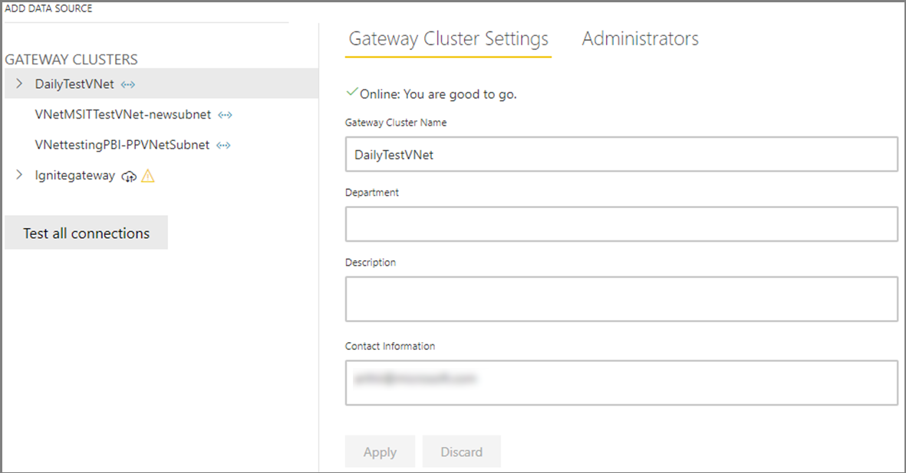
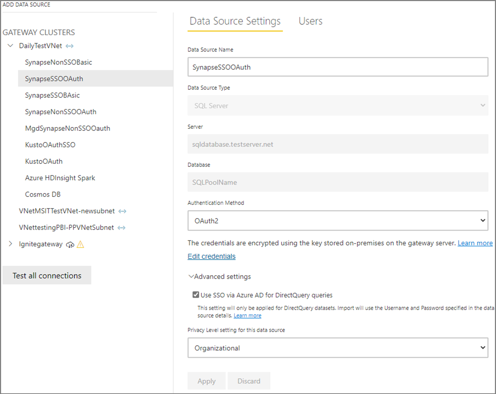
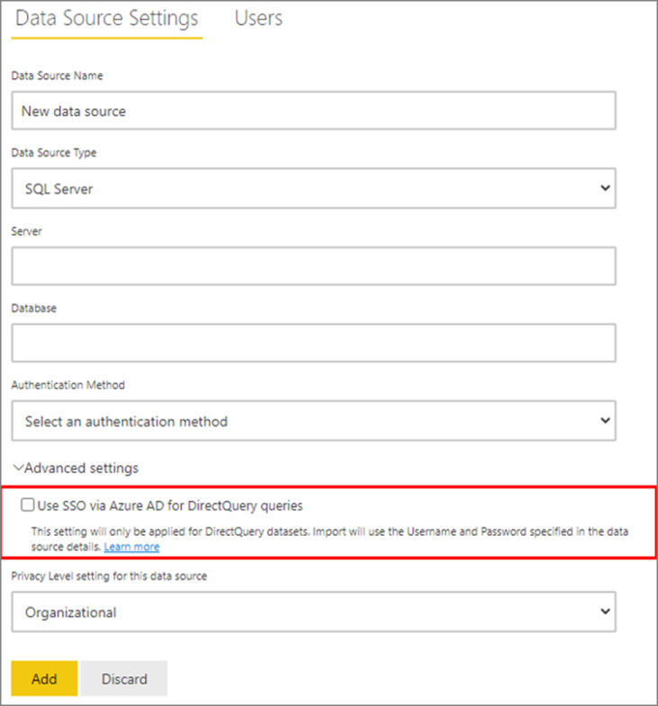
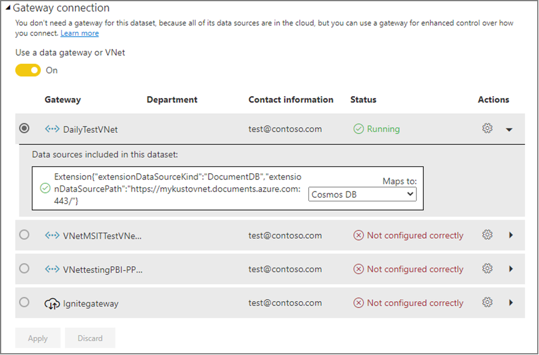

# Use virtual network data gateway and data sources in Power BI

Virtual network data gateways allows import or direct query datasets to connect to data services within an Azure VNet without the need of an on-premises data gateway. 
   
> [!NOTE]
> Virtual network data gateways is a premium-only feature, and will be available only in Power BI Premium workspaces.

## Manage Virtual network data gateways

You can manage admins for a virtual network (VNet) data gateway like you do for standard data gateways either in the Power Platform admin center or on the **Manage gateways** page in Power BI.

## Manage data sources

You can also create data sources and share these data sources to users like you do today for data sources created on the standard data gateway.

## Supported Azure data services 

In the current release, VNet data gateways will support connectivity to the following Azure data services: 
- Azure SQL
- Azure Synapse Analytics
- Azure Data Explorer (Kusto)
- Azure Table Storage
- Azure Blob Storage
- Azure HDInsight (Spark) 
- Azure Data Lake (Gen2)
- Cosmos DB

## Azure Active Directory Single Sign-On for Direct Query

When a user interacts with a DirectQuery report in the Power BI Service, each cross-filter, slice, sort, and report editing operation can result in queries that execute live against the underlying Azure VNet data source. When you configure Single Sign-On (SSO) for an applicable data source, queries execute under the Azure Active Directory (Azure AD) identity of the user that interacts with Power BI.

To enable Azure AD SSO, on the **Manage Gateways** page in Power BI, go to the **Data source setting** page, and select the **Use SSO via Azure AD for Direct Queries** check box.

## Use virtual network (VNet) data gateways in Power BI datasets

A Power BI report maker or creator can now publish a report and associate the dataset to the VNet data gateway data source.

